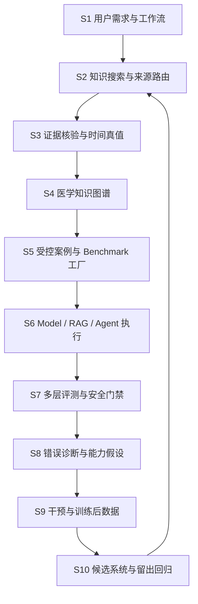

# GroundSignal Medical：把医疗模型的每一次回答，变成可追溯、可诊断、可改进的证据链

> 项目仓库：[zehaoli0324-cloud/groundsignal-pharma](https://github.com/zehaoli0324-cloud/groundsignal-pharma)  
> 本文核验快照：`main` 分支 commit `fda5d0b281eddfbf9d200941ffadc8628e9ed19c`，2026-09-07  
> 项目性质：医疗大模型评测与训练后基础设施原型，不是面向患者的临床决策系统

## 摘要

医疗大模型最难处理的，并不只是“是否记住了一个医学知识点”，而是：它能否找到与问题类型匹配的权威来源，能否识别文档版本和适用范围，能否把证据转换成不过度外推的医学判断，能否在信息不足时澄清或拒答，以及系统出错后，团队能否准确定位是检索、证据验证、知识图谱、生成、工具使用还是评分器出了问题。

GroundSignal Medical 围绕这条完整链路构建了一套十阶段系统：从真实用户需求发现开始，经过权威知识搜索、证据核验、时间化知识图谱、受控评测案例生产、模型与医疗 Agent 执行、多层评分、错误归因、训练后数据生成，最终回到全新留出集上的安全回归。它的目标不是再做一个静态医学题库，而是把“发现问题—解释问题—选择干预—证明修复”连接成可审计的医疗模型开发闭环。

当前仓库已经形成高溯源、偏精度优先的医学知识与评测原型，但知识覆盖仍不全面；S3 命题抽取与证据关系、S4 图谱状态机已有有限范围的独立新鲜评测证据，S5 评测数据工厂仍被主动阻断，尚未获得专家金标准批准，也没有声称完成临床验证或真实训练收益证明。

## 术语表

- **RAG — Retrieval-Augmented Generation（检索增强生成）**：模型回答前先检索外部证据，再结合证据生成答案，用于降低知识过时与无依据回答。
- **Agent（智能体）**：能够自主选择工具、制定搜索步骤、读取结果并决定何时停止的模型系统。
- **KG — Knowledge Graph（知识图谱）**：用“节点—关系—证据”组织知识，使系统能够追踪事实之间的连接、来源和时间状态。
- **Claim（命题）**：一条可以被单独核验的陈述，例如“某药在肾小球滤过率低于某阈值时禁用”。
- **Provenance（溯源）**：一条事实来自哪个文档、哪个版本、哪个段落，以及经过了什么审核。
- **Held-out（留出集）**：不参与当前系统调试的数据，用来检验泛化。
- **Fresh held-out（全新留出评测）**：先冻结实现，再创建的新测试；首次结果永久保留，不能在修复后改写成“首次通过”。
- **Hard gate（硬门禁）**：不能被平均分抵消的失败条件，例如严重医疗安全错误、评测泄漏或伪造来源。
- **SFT — Supervised Fine-Tuning（监督微调）**：使用经过审核的输入—理想输出样本继续训练模型。
- **LLM-as-a-Judge — Large Language Model as a Judge（大模型评分器）**：让大模型依据评分规则评价另一个模型的答案，但必须校准其偏差和一致性。
- **FDA — Food and Drug Administration（美国食品药品监督管理局）**：美国药品批准、说明书与安全监管的核心权威来源。
- **NMPA — National Medical Products Administration（中国国家药品监督管理局）**；**CDE — Center for Drug Evaluation（药品审评中心）**：用于核对中国药品受理、审评、批准与相关指导原则。
- **EMA — European Medicines Agency（欧洲药品管理局）**：用于核对欧盟药品授权与产品信息。
- **LOINC — Logical Observation Identifiers Names and Codes（检验与临床观察标准编码体系）**：用于统一检验和临床观察项目身份。
- **CYP — Cytochrome P450（细胞色素 P450 酶系）**：参与许多药物代谢，也是药物相互作用判断中的重要关系类型。
- **eGFR — estimated Glomerular Filtration Rate（估算肾小球滤过率）**：用于描述肾功能并匹配部分药物的使用阈值。
- **MRI — Magnetic Resonance Imaging（磁共振成像）**：在本文案例中用于对不确定性影像发现做进一步定性。
- **P0 — Priority 0（最高优先级）**：当前首先建设和验证的任务与数据范围。
- **F1 score（F1 分数）**：精确率与召回率的调和平均，用于综合衡量命题抽取表现。
- **Recall@K（前 K 项召回率）**：目标来源或关键证据是否出现在排名最前的 K 个结果中。
- **Benchmark（基准评测集）**：用固定任务、数据与评分契约比较模型或系统能力的评测资产。
- **Post-training（训练后优化）**：基础模型训练完成后的监督微调、偏好优化等干预过程。

## 一、项目背景：医疗模型的核心风险不是“不会答”，而是“错得像真的”

通用问答系统常用“答案是否接近参考答案”来衡量正确性，但医疗场景中的失败往往发生在更深的层次：

- 三期试验达到主要终点，被升级成“药物已经获批”；
- 旧版说明书或指南，被当成当前有效规则；
- 回答附有网址，但该网页的具体段落并不支持所写结论；
- 血清铁偏低，被直接升级成“已经确诊缺铁性贫血”；
- 影像报告写的是“不确定性病灶”，模型却把它说成癌症，或反过来保证良性；
- RAG 已经检索到禁忌证，生成模型却没有在答案中使用；
- Agent 面对足够证据仍持续搜索，面对高风险问题却在检索前先下结论；
- 用户缺少肾功能、剂量或具体药名等关键信息，模型仍强行给出用药建议。

这些错误只看最终文本很难定位。即使一句答案是错的，根因也可能完全不同：来源选错、文档过期、段落召回失败、否定词漏读、关系外推、条件丢失、图谱旧状态未失效、模型忽略证据，甚至评分器本身判错。若不拆开评测，团队很容易用“再加一些训练数据”去补偿一个本应修复检索器、数据契约或评测器的问题。

GroundSignal 因此聚焦三个痛点：

1. **医学真值不可追溯**：答案、证据、版本和适用范围没有形成可审计链路。
2. **错误不可归因**：端到端分数告诉团队“错了”，却不告诉团队错在哪一环。
3. **优化不可证明**：修复一个已见案例后，无法判断是真正泛化，还是对测试题过拟合；平均分上升也可能掩盖新的严重安全错误。

## 二、总体框架：十个 Stage 组成一条模型开发闭环



这十个阶段不是按代码目录机械拆分，而是按“一个错误能否被定位到具体决策节点”来拆分：

- S1 决定系统应该解决哪些真实任务；
- S2 决定应该去哪一种权威来源查；
- S3 决定某个段落到底支持什么、不支持什么；
- S4 把已核验事实连接成可更新、可冲突、可追溯的图谱；
- S5 把用户任务与图谱真值转成可诊断的受控实验；
- S6 以固定配置运行模型、RAG 或 Agent，并完整记录过程；
- S7 同时评价答案、图谱依据、检索和工具轨迹；
- S8 把单个错误归纳成可验证的能力缺口；
- S9 选择最小且合适的干预，而不是默认训练模型；
- S10 在未见数据上证明改进没有制造新的安全回退。

## 三、知识从哪里来：来源质量与证据强度分开管理

GroundSignal 不把“网上能搜到”当作知识进入系统的充分条件。当前来源注册表包含 **25 类来源**，按其能够证明的事实类型分级，而不是给网站做一个笼统的好坏排名。

| 层级 | 当前数量 | 主要来源 | 可以承担的角色 |
|---|---:|---|---|
| Tier 0：监管或最高优先级原始真值 | 13 | DailyMed、Drugs@FDA、美国食品药品监督管理局药物相互作用/药物基因组/安全通告、欧洲药品管理局、中国国家药品监督管理局药品审评中心、国家卫生健康委员会等 | 当前说明书、获批状态、禁忌证、监管安全更新、方法学和国家级路径 |
| Tier 1：权威结构化或专业参考 | 8 | ClinicalTrials.gov、RxNorm、LOINC、LiverTox、世界卫生组织、美国心脏协会、美国疾病控制与预防中心、美国国家肾脏基金会 | 试验注册状态、药物/检验标准化、专业背景和警示信息 |
| Tier 2：科学证据、信号或患者信息支持 | 4 | PubMed、openFDA/FAERS、MedlinePlus、Merck Manual | 论文发现、不良事件信号发现、患者表达与临床背景；通常不能单独升级为高风险处置规则 |

这里有一个关键原则：**来源权威，不等于它对任意命题都有足够证据强度。** ClinicalTrials.gov 可以证明“某试验已注册、处于什么阶段、登记了什么终点”，却不能仅凭注册记录证明疗效；FAERS（FDA Adverse Event Reporting System，美国食品药品监督管理局不良事件报告系统）可以发现自发报告信号，却不能直接证明因果关系或真实发生率；RxNorm 可以统一药物身份，却不负责给出患者如何调整剂量。

项目也保留了显式标记的合成证据，用来构造变量可控的实验，例如比较“旧指南—新研究—新版指南”的时间关系。合成证据具有受控实验的内部有效性，但不会冒充真实临床事实。

## 四、现在有多少知识：小而精、可追溯，但远非“覆盖全部医学”

本文按当前仓库代码重新执行了知识校验与图谱构建，结果如下：

| 资产层 | 当前规模 | 含义 |
|---|---:|---|
| 用户任务种子 | 48 条 | 覆盖用药安全、分诊、临床推理、检验/报告解读、证据比较、多轮对话、Agent 和多模态准备任务 |
| P0 场景家族 | 12 个 | 每个家族围绕一个稳定能力问题构建 |
| 受控评测案例 | 60 个 | 每个家族 5 个：基础、受控变体、对抗/回归与留出变体 |
| 来源注册表 | 25 类 | 13 个 Tier 0、8 个 Tier 1、4 个 Tier 2 |
| 案例证据清单 | 12 份 | 与 12 个场景家族一一对应 |
| 案例局部来源记录 | 19 条 | 当前案例实际冻结使用的来源快照 |
| 案例级原子命题 | 43 条 | 均标记为 `source_verified`，但不等于临床专家金标准 |
| 可复用医学骨架 | 20 个模块、54 条命题 | 含 CYP 酶、转运体、药物基因组、出血、QT、肾/肝功能、妊娠/哺乳、低血糖等有限模块 |
| 当前可重建规范图谱 | 150 个节点、109 条边 | 102 条 `source_verified` 边，7 条系统设计契约边 |
| 医药产业情报轨道 | 13 个实体笔记、14 个产品、8 个靶点、12 个事件、2 个产能专题 | 服务监管事件、管线、竞品、授权和影响传播分析 |

这些数字说明项目已经具备“以证据为中心的结构化原型”，但不能被描述为全面医学知识库。当前优势集中在证据溯源、时间真值、若干用药安全规则、有限的临床推理/报告案例，以及特定医药产业领域；系统性药代动力学、广泛药物相互作用、肝肾剂量、儿科、老年、妊娠哺乳、药物基因组、毒理、抗菌药物管理、多模态知识和常见病广覆盖仍然不足。

项目采用的是“**关键决策知识优先**”策略：宁可先维护一个范围较小、每条高风险关系都有来源与边界的图谱，也不快速堆出一个来源不清、无法判断新旧和适用范围的大型知识库。

## 五、信息如何搜索、清洗、分级和分类

### 1. 先判断问题类型，再决定去哪里查

系统不会用同一个搜索入口回答所有问题，而是先做意图路由。例如：

| 用户问题 | 首选来源 |
|---|---|
| 某药当前美国说明书的剂量、警告、禁忌证 | DailyMed / Drugs@FDA |
| 药物是否已获批 | 对应监管机构批准记录 |
| 某 NCT 试验是否仍在招募 | ClinicalTrials.gov |
| 品牌名、通用名、成分与剂型如何统一 | RxNorm |
| 化验项目如何映射成标准概念 | LOINC |
| CYP 酶或转运体角色 | FDA 临床药理与相互作用表 |
| 自发不良事件是否存在信号 | openFDA / FAERS，仅作为信号 |
| 同行评议临床研究 | PubMed 定位论文后，再核对研究设计与原文 |

S2 当前将双语语义特征、意图分类和来源策略分开，使“用户提到了 FDA”不再自动等于“任何问题都去 FDA”，也使“不要看二手文章”这类排除条件可以被单独记录。

### 2. 搜索前先做实体标准化

药物搜索需要拆分有效成分、品牌/通用名、规格、剂型、给药途径和司法辖区；检验指标则需要区分样本、单位、方法和临床语境。这样可以避免把相同成分的不同剂型视为完全相同，也避免把“识别一个检验项目”和“解释一个异常阈值”混为一谈。

### 3. 从“网页”清洗成“可核验原子命题”

系统不把整个页面直接塞进知识库，而是建立如下证据链：

```text
来源文档
→ 文档版本、发布日期与司法辖区
→ 章节/段落/表格定位
→ 原子命题
→ 人群、适应症、剂量、途径、器官功能等适用范围
→ 证据角色与时间状态
→ 审核状态
```

例如“二甲双胍缓释制剂在 eGFR 低于 30 mL/min/1.73m² 时禁用”需要保留具体制剂、数值运算符、单位、说明书版本和章节位置。若只保留“肾功能不好不能用”，信息虽然更短，却丢失了能够决定临床判断的边界。

### 4. 把“事实”“推断”和“假设”分开

图谱关系状态包括 `OBSERVED`（直接观察/来源明确）、`DERIVED`（由规则计算得到）、`HYPOTHESIS`（待验证假设）、`DISPUTED`（证据争议）、`SUPERSEDED`（已被替代）和 `UNKNOWN`（尚未解决）。医药产业轨道也使用 OBSERVED、DERIVED、HYPOTHESIS 三层输出，避免把共享靶点直接写成“确定的直接竞争关系”。

### 5. 冲突不删除，而是解释冲突来自哪里

当两个来源不一致时，系统先检查时间、司法辖区、人群、剂型、研究终点和来源角色，再将冲突标记为范围差异、时间替代、真实争议或尚未解决。旧事实不会从历史中消失，但不能继续以当前 `ACTIVE` 状态参与回答。

### 6. 逐级审核，并对高风险知识设置拒收条件

知识从 `DISCOVERED`（仅发现）依次进入 `MACHINE_PARSED`（机器解析）、`SOURCE_VERIFIED`（来源与段落支持命题）、`DOMAIN_REVIEWED`（领域专家审核）和 `GOLD_APPROVED`（允许进入冻结金标准）。当前许多案例停留在 `source_verified` 和 `gold_review_needed`，项目明确不把结构校验通过写成专家认可。

以下情况会被拒绝进入高风险生产真值：找不到具体段落；引用与命题不蕴含；越过人群、剂型或剂量范围；以旧文档充当当前规则；用公司新闻证明获批；用自发报告证明因果；仅凭体外机制生成患者处置建议；药物身份未统一；高风险命题缺少所需专家审核。

## 六、多种信息如何建立连接：知识图谱不是展示图，而是真值与评分底座

GroundSignal 同时维护四类图谱层：

1. **案例局部图**：连接具体患者状态、症状、检验、用药与本案例需要的规则；
2. **可复用药理与安全骨架**：维护酶、转运体、药物、特殊人群和安全结局之间的有限高价值关系；
3. **医药时间证据轨道**：连接公司、产品、靶点、试验、监管事件、授权与产能变化；
4. **规范合并图**：把前三类知识按兼容语义合并，同时保留原始上下文、证据和审核状态。

以二甲双胍为例，系统连接的不是“二甲双胍—肾功能不好”这两个词，而是：

```text
患者案例 HAS_LAB → eGFR = 27
患者案例 TAKES → 二甲双胍缓释制剂
二甲双胍缓释制剂 CONTRAINDICATED_IN → eGFR < 30 规则
该规则 SUPPORTED_BY → 当前说明书具体段落
```

这条结构让系统可以判断：27 命中禁忌阈值，31 不应被同一规则机械判定为“低于 30”，缺少 eGFR 时则应先澄清。它也能够阻止凭空新增“因此必须改用胰岛素”这样的无证据关系。

再如影像报告写“indeterminate lesion，建议 MRI 进一步定性”，正确连接是“不确定性发现—建议进一步检查”，而不是“不确定性发现—确认癌症”。评分器可以允许多种自然语言表达，但要求答案保留原关系强度。

在产业情报侧，交叉关系扫描会比较公司或资产的共享靶点、适应症、治疗模式、开发阶段、投资者、授权与试验连接，并输出直接事实、结构化推断或待验证假设。由此可以生成竞争层级、合作候选、事件影响链和优先级 watchlist（监测清单），但启发式推断仍需证据复核，不能自动升级为事实。

## 七、RAG 如何找到知识，以及知识如何转化为“智能”

### 1. 理想的在线链路

```text
用户问题
→ 意图与风险识别
→ 实体/剂型/单位/司法辖区标准化
→ 权威来源路由
→ 当前版本文档检索
→ 章节与段落排序
→ 命题级核验、冲突与时间检查
→ 图谱子图与证据段落打包
→ 模型生成或 Agent 继续调用工具
→ 答案中的每个关键结论回链到证据
```

RAG 的价值并不是“给模型更多文字”，而是给它**与当前问题匹配、版本正确、范围明确的最小证据集合**。对于一个高风险结论，系统还需要知道关键段落是否进入前 K 个结果：如果没有进入，是检索失败；如果已经进入但答案仍然忽略它，则是生成或证据使用失败。这两类问题应采用完全不同的修复。

### 2. 当前仓库已经实现到哪里

当前 S2 已具备确定性意图路由、多个官方来源的在线适配器，以及 DailyMed 最新版本与关键章节检索的有限测试；在三个高风险说明书场景中，当前版本一致性和关键段落 Recall@1 均达到 3/3。模型执行器支持关闭检索与“冻结证据注入”两种配置，并记录模型版本、提示词版本、证据快照、Top-K、已注入段落 ID、耗时与运行 ID。

但必须说明：当前模型执行器中的 RAG 仍主要是按案例预先允许的 `passage_id` 注入冻结证据，用于验证管线和做可控归因；仓库尚未完成面向整个知识库的生产级向量检索、重排序器和真实 Agent 工具执行。因此，当前可以证明“检索链路可测、证据注入可复现”，还不能证明“大规模真实医学语料上的生产 RAG 已经完成”。

### 3. 从“找到知识”到“产生智能”

GroundSignal 将智能定义为在证据边界内完成决策，而不只是复述搜索结果：

- **问答智能**：把多个段落压缩成用户能理解的答案，同时保留条件和不确定性；
- **临床推理智能**：连接症状、检验与鉴别诊断，指出什么证据支持、什么证据仍缺失；
- **时间智能**：识别说明书、指南和试验状态的变化，避免把历史真值当成当前真值；
- **关系智能**：连接药物—靶点—适应症—试验—公司，区分机制邻近、市场竞争和直接竞争；
- **行动智能**：告诉用户下一步需要澄清、检索、复查、升级处理还是停止搜索；
- **模型开发智能**：把错误路由到检索、提示词、监督微调、偏好优化、Agent 轨迹或评分器校准，并在留出集上检验修复。

## 八、每个 Stage 如何评测：指标、Bad Case 与解决方案

GroundSignal 对每个阶段都要求固定五件事：输入、预期输出或金标准、能力指标、失败分类、回归集。下游出错时，必须先排查上游，不能先假设“大模型推理能力不足”。

| Stage | 主要评测方法 | Bad Case 示例 | 解决方案与当前状态 |
|---|---|---|---|
| **S1 用户需求发现** | 检查角色、任务类型、频率、严重度、真实性、覆盖率与 AI 可创造价值；用访谈、问卷、脱敏日志对种子任务校准 | 设计者认为“解释论文”很重要，但真实用户最常见且风险更高的是药物同服、漏服和急症分诊 | 用真实用户研究重新加权，按频率×风险×AI 价值排序；当前有 48 条设计种子和高风险矩阵，但缺真实访谈/日志频率证据，因此为 Partial |
| **S2 知识搜索与来源路由** | Primary Source Recall@1、可接受来源 Recall@3、当前版本召回、错误权威率、关键来源漏检率；把来源可用性与语义检索分开测 | v0.4 中“不涉及监管、说明书或试验注册，我只要同行评议文献”，否定作用域没有覆盖并列列表，系统仍被“试验注册”带向错误来源 | 从关键词距离升级为子句级否定范围，分开“司法辖区上下文”和“被排除的任务意图”；该 v0.4 开发集仍为 FAIL。此前 v0.3 全新路由集 22/24，91.7%，S2→S3 联合 17/18，94.44% |
| **S3 证据验证与命题抽取** | 段落定位、命题 Precision/Recall/F1、否定与极性、条件绑定、人群范围、时间与替代关系、高风险假阳性、强制拒答 | “在 eGFR<25 时，既有患者停药，而新患者不应开始”包含两个事件；旧实现只把条件绑定到第一个事件，使第二个命题被错误扩大成无条件规则 | 将实际识别出的管理事件与条件作用域使用同一事件注册表，并增加类型化指代与保守拒答。v0.5.6.1 全新集 F1 98.90%、关键命题召回 100%、6/6 必须拒答、高风险假阳性 0，获得有限范围 CONDITIONAL PASS |
| **S4 医学知识图谱构建与更新** | 边 Precision/Recall、类型与溯源完整性、时间边正确性、旧 `ACTIVE` 边数量、冲突集合闭合、回滚与状态不变量 | 新证据在同一天形成 A/B 冲突后，又加入同日 C；旧状态机只检查 `ACTIVE` 邻居，导致 C 错误成为当前有效事实；另有更早的晚到事实绕过争议前沿重新激活 | 把 `ACTIVE` 与未解决 `CONTESTED` 统一为时间前沿，同日冲突必须加入完整争议集合，旧事实只能成为历史。首次全新集 18/20 FAIL；修复后另建独立全新集 20/20 PASS、7/7 必须拒收、旧 ACTIVE=0 |
| **S5 受控案例与 Benchmark 工厂** | 构念效度、单变量隔离、分区和血缘泄漏、金标准状态、身份/路径/载荷完整性；实现冻结后创建 fresh suite，并保存首次观测 | v0.9 中，移除标识符的韩文等价改写绕过污染检测；同时，一个只共享数字与模板结构、但临床变量不同的干净案例被误判为污染 | 增加可检查的韩文概念映射，并仅在结构化检验角色明确互斥且无更强血缘证据时解除误拦截。已暴露集攻击 5/5 阻断、干净对照 4/4 放行，但这只是 exposed repair；S5 仍等待冻结后的全新 v0.10 与独立 Gold review，当前 RELEASE BLOCKED |
| **S6 Model / RAG / Agent 执行** | 相同配置的可复现性、模型/提示词/温度/证据快照一致性、日志完整性、跨提供方输入等价性、工具轨迹完整性 | 同一 case 的两次结果不同，却没有记录提示词版本、证据 Top-K 或工具返回，团队无法判断是模型波动还是配置漂移 | 为每次运行固化模型、提示词、检索器、证据快照、工具、温度、耗时与 run ID，并保存完整 trace；当前只有 runner 与 fixture 证明，因 S5 未放行，尚未开始正式 S6 release eval |
| **S7 多层评价与安全门禁** | 人类一致性、评分维度一致性、确定性规则准确率、安全错误召回、评分器偏严/偏松、表达风格偏差；答案、图谱、RAG、Agent 四层分开评分 | 回答语言流畅且引用很多，但把“不确定性病灶”说成癌症；大模型评分器因文风好给出高分，漏掉关系升级 | 用确定性规则检查禁忌、阈值、来源 ID、时间状态和禁止关系；用专家样本校准 LLM-as-a-Judge；严重安全错误直接触发 hard gate。当前有协议与 rubric，缺真实模型×人类/评分器校准 |
| **S8 错误诊断与能力假设** | 根因诊断准确率、错误聚类稳定性、跨案例复现、因果归因质量；明确“观察到的错误≠能力缺口≠已证实根因” | 关键说明书段落已进入 RAG 上下文，但答案仍忽略禁忌证；如果把它归为 `RETRIEVAL_MISS`，团队会错误优化召回 | 按 S2→S7 顺序检查 trace：本例应归为 `TOOL_RESULT_IGNORED` 或证据使用失败，再用多个案例验证是否为稳定能力簇；当前有 taxonomy 与路由器，缺多模型×多案例实证聚类 |
| **S9 干预与训练后数据生成** | 干预路由正确率、审核通过率、训练数据精度、分区泄漏率、来源与 Gold 完整性 | 一个留出集 bad case 被自动改写成 SFT 样本，导致后续评测答案泄漏进训练数据；或把检索错误误当成模型知识缺口去微调 | 训练导出默认 fail closed：必须保留 source_case、source_run、failure_type、evidence、graph_version、review_status、split 和 intervention；held-out/regression 不能导出，评测失败也不自动成为训练样本。当前只有接口与 schema，S5 门禁尚未放行真实导出 |
| **S10 候选系统与留出回归** | 候选系统相对基线的目标能力变化、无关能力变化、拒答保持、检索/Agent 行为和新增严重安全错误；按场景家族而非近重复随机切分 | 干预后平均准确率从 84% 升到 86%，但新增一条禁忌药推荐，或在缺信息案例中更敢下结论 | 平均分与信任门禁分开：任何预注册严重错误均阻断发布；同时检查基础、缺信息、干扰项、对抗和未见家族。当前只有 baseline-vs-candidate fixture 合约，尚无真实训练后的留出提升证据 |

## 九、三个代表性 Bad Case：如何从“一个错误”走到“系统能力升级”

### Bad Case 1：路由器看到了关键词，却没理解“不要查它”

用户说：“我要中国国家临床路径，不查 CDE 受理或审评状态。”旧路由器把“中国”和“CDE”放在同一特征组；当 CDE 被否定时，“中国”这一正向司法辖区信息也被一起抹掉，最后错误回退到 PubMed。

这个问题不能靠给句子写一个特例解决。它揭示的是“实体/司法辖区”和“任务意图”没有独立建模。正确修复是对否定作用域做子句级建模，并为同一个词在不同语义角色下保留独立极性。修复后还必须重新运行旧回归，再冻结实现并创建新的全新留出集。

### Bad Case 2：图谱把“最新争议”处理成“旧事实复活”

同一医学语义槽位在 2026 年出现两个互相冲突的事实，因此应保持 `CONTESTED`。随后系统收到一条 2025 年的晚到事实。旧实现只寻找更新的 `ACTIVE` 边，没有把未解决争议视为当前时间前沿，于是错误地把 2025 年事实设为 `ACTIVE`。

修复没有添加某个药名或日期的特殊规则，而是重写状态机不变量：当前前沿由 `ACTIVE` 或 `CONTESTED` 共同定义；任何更早事实都不能越过它；同日新冲突必须加入完整争议集合。随后，旧失败集成为暴露回归，另建的 20 条全新轨迹首次运行 20/20 通过。这是 GroundSignal 对“修旧题”和“证明新泛化”做严格区分的代表。

### Bad Case 3：评测数据被“换一种语言”后洗白

S5 的任务是保证留出案例不会进入训练数据。v0.9 的新攻击把受保护内容翻译为韩文并移除明显标识符，系统错误放行；而另一条临床变量不同但数字和模板相似的干净记录却被阻断。

这说明单纯调低相似度阈值无法同时解决召回与误杀。v0.9.1 一方面增加可检查的跨脚本概念证据，另一方面引入“结构化医学测量角色是否相同”的判别：只有当两边的临床测量角色都明确且互斥，并且不存在标识符或字段级强血缘证据时，才允许解除密集数字锚点造成的误拦截。修复在已暴露数据上通过，但项目仍将 v0.9 首次 FAIL 永久保留，并拒绝把 v0.9.1 写成全新泛化成功。

## 十、当前进展：已经证明了什么，还没有证明什么

截至本文快照，项目最重要的成果不是“医疗模型准确率达到多少”，而是建立了能够持续暴露系统问题的评测纪律：

- S2 v0.3 全新意图路由集达到 91.7%，并在有限 DailyMed 场景中实现当前版本与关键段落检索；但 v0.4 否定/排除开发集暴露新问题，仍待结构修复和新的 fresh 验证。
- S3a 在冻结后创建的 34 条新鲜能力案例上达到 F1 98.90%、关键命题召回 100%、6/6 强制拒答、高风险假阳性 0；S3b 在当前有限集达到 40/40，但真实长文档与噪声来源覆盖仍不足。
- S4 经历首次全新评测 18/20 FAIL 后，修复状态机并在新的独立全新集上达到 20/20，证明了受控范围内的时间前沿、冲突闭合和回滚逻辑。
- S5 已连续用来源伪装、路径逃逸、载荷替换、Unicode 身份、检查—使用竞态、跨语言改写、多源拼接和临床角色近邻等攻击寻找漏洞；当前 v0.9.1 已冻结，但没有 v0.10 新鲜资产，S5 仍为 RELEASE BLOCKED，S6 自动信任也继续阻断。
- S6–S10 已有执行、评分、错误路由、训练数据 schema 与回归接口，但还没有真实多模型运行、经校准的人类/大模型评分器、真实训练干预或训练后留出提升证据。

同样重要的是，仓库明确记录了尚未完成的部分：60 个案例尚未全部获得临床专家金标准审核；知识图谱不是全面医学知识库；生产级检索器与重排序器尚未完成；真实医疗 Agent 工具执行、多模态评测、真实用户验证、模型训练收益和临床验证均未被证明。

## 结语：GroundSignal 真正建设的是“可信改进能力”

一个可靠的医疗模型开发系统，不应只回答“这次模型得了多少分”，而应回答：

1. 它在哪些真实医疗任务上能够提供帮助？
2. 错误发生在知识、检索、证据范围、推理、工具使用还是评分器？
3. 这个错误应该通过更新知识、修复检索、修改提示词、生成 SFT/偏好数据、优化 Agent 轨迹还是校准 Judge 来解决？
4. 修复是否在新的、未见过的案例上仍然成立？
5. 改进是否引入了新的严重医疗安全错误？

GroundSignal Medical 的核心价值，正是把这些问题变成一套可记录、可运行、可失败、可复现、可回归的工程与研究框架。它不通过扩大宣传口径来建立可信度，而是通过保留失败、限制结论、区分证据等级，并要求每次改进重新面对未知案例，逐步建立医疗模型真正可被信任的基础。

## 项目内主要依据

- [README：项目定位与当前检查点](https://github.com/zehaoli0324-cloud/groundsignal-pharma/blob/main/README.md)
- [十阶段系统生命周期](https://github.com/zehaoli0324-cloud/groundsignal-pharma/blob/main/docs/15-system-stages.md)
- [各 Stage 当前状态](https://github.com/zehaoli0324-cloud/groundsignal-pharma/blob/main/docs/16-stage-status.md)
- [评测方法与优化结果总账](https://github.com/zehaoli0324-cloud/groundsignal-pharma/blob/main/docs/17-evaluation-methods-and-optimization-ledger.md)
- [知识搜索与核验协议](https://github.com/zehaoli0324-cloud/groundsignal-pharma/blob/main/medical/knowledge-base/SEARCH_AND_VERIFICATION_PROTOCOL.md)
- [医学知识覆盖矩阵](https://github.com/zehaoli0324-cloud/groundsignal-pharma/blob/main/medical/knowledge-base/COVERAGE_MATRIX.md)
- [知识图谱构建方法](https://github.com/zehaoli0324-cloud/groundsignal-pharma/blob/main/medical/knowledge-graph/HOW_IT_IS_BUILT.md)
- [医疗模型统一评测规则](https://github.com/zehaoli0324-cloud/groundsignal-pharma/blob/main/medical/evaluation/rubrics/medical-clinical-v0.2.md)
